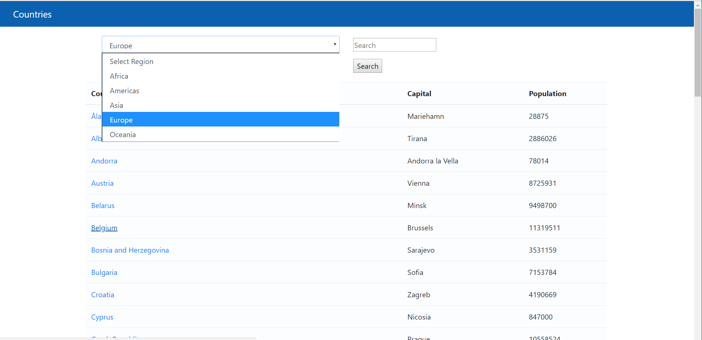
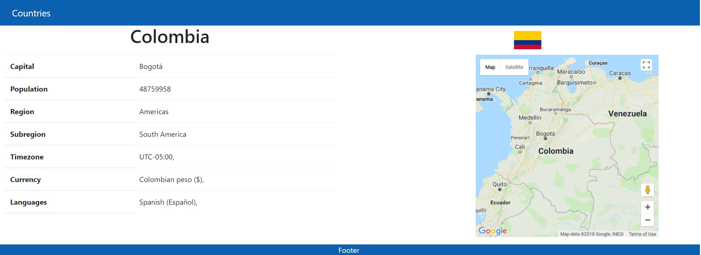
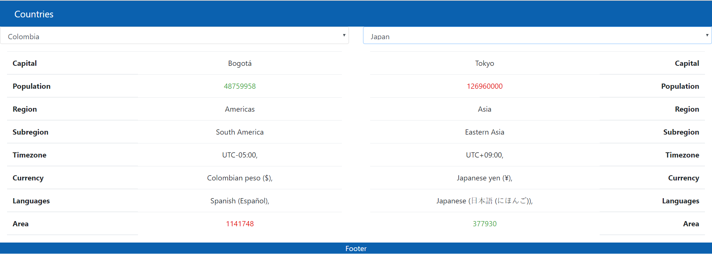

# CountryInformation
Web application that uses "Rest Countries" (API). Displays information for a country including population, region, currency, and capital. Can compare and filter countries. This web application is still being developed.

# Accessing Web Application (NO LONGER HOSTED):
Open home.html

# Screens

